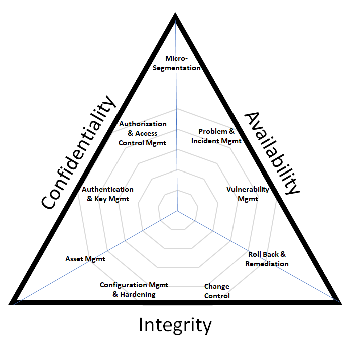

# 24AL733 - Connected Vehicles and Security 
   

## Introduction to Cryptography

### CIA Triad

- Confidentiality
- Integrity
- Availability

  

### Cryptographic Primitives
- Encryption/Decryption Algorithm
- Digital Signature Algorithm
- Cryptographic Hash Function

### Cryptography in Automotive (Automotive Cyber Security)
It is very important to ensure the confidentiality, integrity and authenticity of data in Vehicular Communication. Like, traditional communication networks, we use symmetric and assymetric cryptographic algorithms, hash functions and lightweight protocols for ensuring secure, efficient and privacy-preserving communication within vehicular systems.

Below are the algorithms that could be used for the said purposes:
- **Advanced Encryption Standard (AES):** AES is a symmetric key encryption algorithm known for its efficiency and strong security. It could be used to secure communications between ECUs within vehicles (In-Vehicle Infotainment to Engine Control Module) and external entities (Telematics Control Unit to Road Side Infrastructure). Any interception of data by unauthorized parties could be prohibition.
- **Rivest-Shamir-Adleman (RSA):** RSA is an asymmetric encryption algorithm that is primarily used for secure data transmission. It could be used to secure over-the-air (OTA) software updates and ensuring the authenticity of messages through digital signatures. The OTA server signs the package with its private key, and the vehicle uses OTA server's public key to verify the signature, ensuring the update is genuine and has not been tampered with.
- **Elliptic Curve Cryptography (ECC):** ECC is more suitable for smaller key sizes, making it more efficient for use in systems with limited computational resources. In keyless entry systems, ECC can be used for the key exchange protocol between the key fob and the vehicle, ensuring that the communication is secure and resistant to eavesdropping, even if the signal is intercepted.
- **Secure Hash Algorithm (SHA):** SHA is used for creating hash values from data to ensure data integrity. SHA-256 and SHA-3 are among the variants used in automotive systems for verifying software integrity and authenticity. The digital signature is not but the encryption of message hash using the sender's private key. In over-the-air (OTA) software updates, before installing a new firmware update, a vehicle uses SHA-256 to verify the integrity of the downloaded firmware package. The vehicle computes a hash of the package and compares it to the hash provided by the manufacturer. If they match, it confirms that the package has not been altered or corrupted.

#### Factors influencing the choice of algorithm
- Application Requirements (Confidentiality, Integrity and Authentication)
- System Resources (Computational Power and Network Bandwidth)
- Security Requirements (Data Protection Level and Long-term Security)
- Regulatory and Standards Compliance

### References
- Encryption Algorithms in Automotive Cybersecurity | Embitel. Retrieved from https://www.embitel.com/blog/embedded-blog/decrypting-the-encryption-algorithms-implemented-in-automotive-cybersecurity

