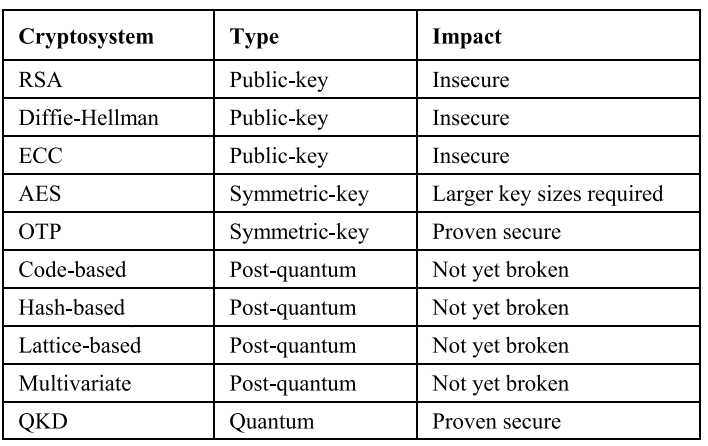

# 24AL733 - Connected Vehicles and Security 
   
  

## CVS#06 - Threats in V2I Communications
   
   
 

### Problem Statement
Vehicle-to-Infrastructure communications and larger vehicular networks are facing an ever-increasing cybersecurity threat such as denial-of-service attacks, message tampering, and Man-In-the-middle which begin to erode system reliability and user privacy. Conventional cryptography is becoming more and more vulnerable to the rise of quantum computing, initiating the necessity of developing quantum-secure security frameworks. Quantum Key Distribution is capable of offering theoretically unbreakable encryption for secure key exchanges, while Quantum Machine Learning is designed to address real-time threat detection and anomaly identification in Intelligent Transportation Systems. Integration of QKD and QML into V2I communication poses challenges in terms of scalability, computational overhead, and real-time adaptability. This is where efficient quantum-secure architectures that guarantee a robust, privacy-preserving, and future-proof security solution for connected vehicle networks need to be created.

---

### Literature Survey
The article shows a Quantum Key Distribution (QKD)-secured Vehicle-to-Infrastructure (V2I) communication system under the AirQKD project. It utilizes Free Space Optical (FSO)-QKD to substitute conventional Public Key Infrastructure (PKI) with quantum-based encryption keys for secure, real-time vehicular communication. Combined with Zero-Trust Authentication Protocol (ZAP)and Physical Unclonable Functions (PUFs), the system provides protection against cyber attacks such as message spoofing. Real-world trials at Warwick University confirmed its success in protecting V2I data exchanges. The research demonstrates QKD's application in future 6G networks and Intelligent Transportation Systems (ITS) and offers a scalable, quantum-safe security framework for connected vehicles.[1]

The paper presents the evolution of Quantum Key Distribution (QKD) networks and their secondary role securing future communication infrastructures towards the Quantum Internet (Qinternet). It discusses the architecture, protocols, and implementation of QKD networks, emphasizing the development from point-to-point links through the emergence of large-scale networks including satellite-based QKD and trusted relay networks. The study also reviews physical and network layer solutions, standardization efforts, and other real-life applications in the fields of finance, defense, and critical infrastructure. By addressing challenges in scalability, security, and integration with classical networks, the paper sets the foundation for future global QKD networks as well as quantum-secure communication systems.[2]

The paper will dissect the role of Free-Space Optical Quantum Key Distribution in enabling secure and scalable communications as part of the AirQKD project. It emphasizes that FSO-QKD could boost 5G and future networks with quantum-secure encryption for metropolitan-scale last-mile connectivity. The study describes the design, development, and deployment of QKD systems, integrating single-photon components, key management modules, and real-world testing. By demonstrating the applicability of FSO-QKD in urban settings, the paper paves the way for its future deployability in 6G networks, the V2I secure communication pathway, and quantum-safe critical infrastructure that integrally links classical and quantum security paradigms.[3]

---

### Proposed Work
For now, to detect attacks like MITM and DDoS, QML would be the ideal solution. For prevention, which is the next step, QKD would be a better option, as other existing detection and prevention algorithms have vulnerabilities that can lead to attacks.  
For example, in V2I communication, vehicles need to communicate with RSUs in real time and at high speed. In such scenarios, RSA and ECC are computationally intensive and take significant time to generate and verify keys, which is the core process of RSA and ECC. This delay can slow down real-time attack detection. In contrast, QKD and QML offer faster and more efficient security mechanisms.

  

1. RSA (Rivest-Shamir-Adleman) – A widely used public-key cryptosystem but insecure against quantum attacks due to Shor’s algorithm. 
2. Diffie-Hellman – A key exchange protocol vulnerable to quantum computers, which can efficiently solve its discrete logarithm problem. 
3. ECC (Elliptic Curve Cryptography) – A public-key cryptosystem that is more efficient than RSA but still insecure against quantum attacks. 
4. AES (Advanced Encryption Standard) – A strong symmetric-key algorithm, but quantum attacks require larger key sizes for security. 
5. OTP (One-Time Pad) – A theoretically unbreakable encryption method if keys are truly random and used only once. 
6. Code-based Cryptography – Uses error-correcting codes for encryption; not yet broken by quantum algorithms. 
7. Hash-based Cryptography – Relies on cryptographic hash functions; secure against quantum attacks but has limited applications. 
8. Lattice-based Cryptography – Uses hard lattice problems for security; considered strong against quantum threats. 
9. Multivariate Cryptography – Uses polynomial equations for encryption; not yet broken by quantum computers. 
10. QKD (Quantum Key Distribution) – Uses quantum mechanics for secure key exchange, ensuring proven security against eavesdropping. 

---

### Tools:
1. OMNeT++ (5.2 version)
2. SUMO (latest version)
3. Veins Framework (latest version)
4. Python (for QML-based attack detection)

 ### Methodology 
 Methodology for Quantum-Based Attack Detection & Prevention in V2I Communication
1.	System Architecture Design
•	Define the Vehicle-to-Infrastructure (V2I) communication model using Simulink & VEINS.
•	Identify the key components: 
o	Vehicle Communication Unit (VCU) (Simulated vehicle)
o	Roadside Unit (RSU) (Infrastructure communication node)
o	Attacker Model (Simulated cyberattacks)
o	Intrusion Detection System (IDS) (Quantum-based anomaly detection)
•	Integrate QKD for secure key exchange.

2.	Attack Simulation in Simulink & VEINS
•	Simulate a V2I network with OMNeT++, SUMO, and VEINS.
•	Inject cyberattacks to test detection capabilities: 
o	Denial of Service (DoS) (Overloading RSU)
o	Man-in-the-Middle (MITM) (Intercepting vehicle messages)
•	Monitor packet transmission delays, abnormal behavior, unauthorized messages.

---

### References
1. https://www.mdpi.com/2624-8921/5/4/86
2. https://ieeexplore.ieee.org/document/10713122
3. https://ieeexplore.ieee.org/document/9684555

