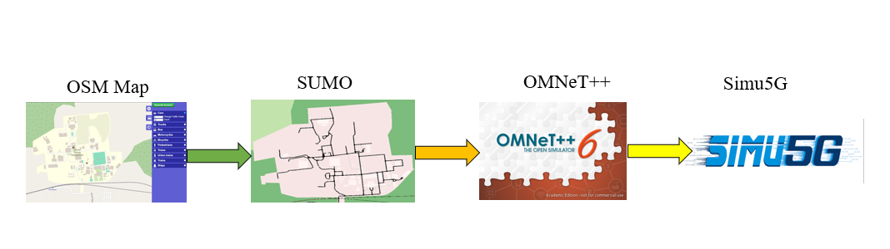

# 24AL733 - Connected Vehicles and Security

   
 

## CVS#07 - Role of 5G in Vehicle-to-Everything (V2X) Communication

  
  
 

### Problem Statement

The integration of 5G technology into Vehicle-to-Everything (V2X) communication is revolutionizing the landscape of connected and automated mobility. Traditional systems, such as Dedicated Short-Range Communication (DSRC) and LTE-based networks, have struggled with limitations in scalability, latency, and security, which hinder their ability to meet the growing demands of modern V2X applications. As vehicular networks become more data-intensive and time-sensitive, these systems fail to provide the required efficiency, particularly in high-density urban environments where communication channels are easily congested. 5G addresses these challenges with its advanced capabilities, offering low-latency, high-bandwidth, and highly reliable communication solutions that enable seamless data exchange and support real-time decision-making in critical scenarios.

---

### Literature Survey

1. 5G MEC-Enabled Vehicle Discovery Service for Streaming-Based CAM Applications
    * Authors: Gorka Velez, Josu Perez, Angel Martin
    * Source: Multimedia Tools and Applications, 2022
    * Focus: This study highlights the use of Multi-access Edge Computing (MEC)  to optimize vehicle discovery in connected and automated mobility (CAM) applications. The proposed Vehicle Discovery Service (VDS) employs a centralized MEC system to efficiently identify and connect vehicles within a geographical Region of Interest (ROI). This avoids the inefficiencies of traditional broadcast-based discovery methods, particularly in dense urban environments.
    * Contributions:
      * Developed a novel architecture using WebRTC for low-latency streaming.
      * Evaluated spatial accuracy and end-to-end latency for applications like See-Through video streaming.
      * Demonstrated scalability and reduced communication delays using real-world vehicular datasets.
  
2. A Group-Based Multicast Service Authentication and Data Transmission Scheme for 5G-V2X
   * Authors: Ruhui Ma, Jin Cao, Yinghui Zhang, et al.
   * Source: IEEE Transactions on Intelligent Transportation Systems, 2022
   * Focus: This paper introduces a secure and efficient group-based authentication scheme tailored for 5G-V2X multicast services. The model ensures seamless and secure data transmission for a large number of vehicles while addressing issues such as signaling congestion and mobility challenges.
   * Contributions:
     * Introduced a group authentication process to reduce signaling overhead during multicast service access.
     * Proposed dual-key technology for secure and efficient key distribution.
     * Formal verification showed robustness against protocol attacks, ensuring data privacy, anonymity, and unlinkability.
     * Demonstrated superior computational and communication efficiency compared to existing methods.

3. On 5G-V2X Use Cases and Enabling Technologies: A Comprehensive Survey
   * Authors: Ahmad Alalewi, Iyad Dayoub, Soumaya Cherkaoui
   * Source: IEEE Access, 2021
   * Focus: This survey comprehensively reviews V2X use cases, 5G enabling technologies, and their applications in vehicular communication. It maps the requirements of V2X applications to 5G capabilities, such as ultra-reliable low-latency communication (URLLC) and massive machine-type communication (mMTC).
   * Contributions:
     * Provided a detailed classification of V2X use cases into safety, traffic efficiency, and infotainment.
     * Discussed enabling technologies like edge computing, network slicing, full-duplex communication, and artificial intelligence.
     * Highlighted challenges such as resource management, interoperability, and integration of advanced communication protocols.
     * Identified research gaps, including low-latency communication for safety-critical scenarios and efficient spectrum utilization.
4. Toward 5G Edge Computing for Enabling Autonomous Aerial Vehicles
   * Authors: Gerasimos Damigos, Tore Lindgren, George Nikolakopoulos
   * Source: IEEE Access, 2023
   * Focus: This paper explores the use of 5G-enabled edge computing to support time-critical control operations in unmanned aerial vehicles (UAVs). The study emphasizes the role of edge servers in reducing latency for closed-loop control systems, using real-world 5G networks.
   * Contributions:
     * Proposed a 5G-enabled architecture for offloading computationally intensive tasks to edge servers.
     * Evaluated round-trip latency, jitter, and system behavior in high-load scenarios.
     * Experimentally validated the impact of 5G edge computing on UAV performance, including trajectory tracking and obstacle navigation.
     * Identified unexplored areas for optimization, such as path planning and network resource allocation.

---

### Proposed Work

Based on the insights from the literature, the proposed work aims to design and implement a comprehensive 5G-enabled framework for V2X communication. This framework will address the challenges of low-latency data processing, secure communication, and efficient resource utilization in dense and dynamic vehicular environments. The proposed work also integrates real-world testing and simulation to validate the system's performance and reliability.

#### Objective

Validate the effectiveness of V2X communication (V2V, V2I, V2P) in safety-critical scenarios (pedestrian detection, accident alerts, cyberattacks) using a 5G-enabled simulation of the Amrita Vishwa Vidyapeetham, Coimbatore.

#### Key Components

1. 5G Network:

   * Simulate gNBs (5G base stations) and UEs (User Equipment) for vehicles/pedestrians.

   * Configure URLLC (Ultra-Reliable Low-Latency Communication) for accident alerts and eMBB (Enhanced Mobile Broadband) for data-heavy tasks.

2. V2X Communication:

   * CAM/DENM Messages: For real-time coordination (e.g., pedestrian movement, collision warnings).

   * PC5/Uu Interfaces: Direct V2V (PC5) and V2I (Uu) communication.

3. Safety Scenarios:

   * Pedestrian Detection: Trigger alerts when pedestrians cross roads.

   * Accident Scenario: Disseminate emergency alerts to nearby vehicles and emergency services.

   * Cyber Attack: Simulate jamming or spoofing attacks to test network resilience.

---

### Implementation Details

The development and optimization of 5G-V2X systems rely heavily on advanced simulation and testing tools. Traffic simulation platforms like SUMO (Simulation of Urban Mobility) integrate vehicular movement dynamics with communication models, enabling researchers to evaluate network performance under realistic scenarios. Network simulators such as OMNeT++ and NS-3 analyze latency, throughput, and signal interference, providing insights into the impact of traffic loads and mobility patterns on communication efficiency.

#### Tools

|Category |Tools |Purpose |
| ------- |------|--------|
|  Map & Traffic    |OpenStreetMap (OSM), SUMO, JOSM | Create road network, simulate vehicles/pedestrians, and traffic dynamics.|
|Network Simulation |OMNeT++, Simu5G, INET Framework |Model 5G NR, gNBs, UEs, and V2X communication protocols.|
|Integration |Veins, TraCI (SUMO-OMNeT++ API) |Synchronize SUMO traffic with OMNeT++ network simulation.|
|Analysis |Python (Matplotlib, Pandas), Wireshark, SUMO-GUI |Visualize KPIs (latency, packet loss), debug, and analyze network traffic.|

#### Methodology

1. Map Preparation:

   * Extract Amrita Vishwa Vidyapeetham, Coimbatore area from OSM.

   * Convert OSM to SUMO format using netconvert and define traffic demand.

2. Traffic Simulation:

   * Model vehicles, pedestrians, and traffic lights in SUMO.

   * Define routes for peak-hour traffic (e.g., college entry/exit times).

3. 5G Network Setup:

   * Deploy gNBs in OMNeT++/Simu5G to cover the campus area.

   * Assign UEs to vehicles/pedestrians with QoS profiles (e.g., URLLC for DENM messages).

4. Scenario Implementation:

   * Pedestrian Detection: Use CAM messages to broadcast pedestrian locations.

   * Accident Alert: Generate DENM messages on collision detection.

   * Cyber Attack: Inject malicious nodes to disrupt communication.

5. Validation:

   * Compare KPIs (latency, packet delivery ratio) across scenarios.

   * Test network resilience during attacks (e.g., fake message detection).

---

### Architecture Diagram

#### Layers

1. Traffic Simulation Layer (SUMO):

   * Vehicles, pedestrians, and traffic lights.

   * Real-time mobility data exported via TraCI API.

2. Network Simulation Layer (OMNeT++/Simu5G):

   * 5G NR Stack: gNBs, AMF, UPF (Simu5G modules).

   * V2X Protocols: CAM/DENM message handlers.

   * UEs: Vehicles and pedestrians with 5G connectivity.

3. Application Layer:

   * Pedestrian detection logic.

   * Accident alert system.

   * Cybersecurity modules (e.g., intrusion detection).

4. Attack/Scenario Layer:

   * Malicious nodes for jamming/spoofing.

   * Emergency event triggers (e.g., sudden braking in SUMO).

#### Data Flow

* SUMO sends vehicle/pedestrian positions to OMNeT++ via TraCI.

* OMNeT++ processes V2X messages (CAM/DENM) over the 5G network (Simu5G).

* Application layer logic triggers alerts based on received data.

* Attack scenarios disrupt communication (e.g., fake DENM messages).

  

#### Amrita Vishwa Vidyapeetham, Coimbatore area from OSM

  

---

### Mapping the Project to Relevant Sustainable Development Goals (SDGs)

| SDG        | Alignment                                                                         |
|:-----------|:----------------------------------------------------------------------------------|
| *Goal 3 - Good Health and Well-Being*  | Reduces delays caused by traffic congestion, improving response times and lowering fatalities from accidents. Enhances universal access to timely emergency medical care. |
| *Goal 9 - Industry, Innovation, and Infrastructure* | Supports sustainable and resilient infrastructure through the integration of IoT for emergency medical services. Advances innovation in IoT-enabled emergency response systems. |

---

### References

[1]. Alalewi, A. A., Dayoub, I., & Cherkaoui, S. (2021). On 5G-V2X use cases and enabling technologies: A comprehensive survey. IEEE Access.

[2]. Alhilal, A. Y., Finley, B., Braud, T., Su, D., & Hui, P. (2022). Street smart in 5G: Vehicular applications, communication, and computing. IEEE Access.

[3]. Damigos, G., Lindgren, T., & Nikolakopoulos, G. (2023). Toward 5G edge computing for enabling autonomous aerial vehicles. IEEE Access.

[4]. Ma, R., Cao, J., Zhang, Y., Shang, C., Xiong, L., & Li, H. (2022). A group-based multicast service authentication and data transmission scheme for 5G-V2X. IEEE Transactions on Intelligent Transportation Systems.

[5]. Mao, W., Akgul, O. U., Cho, B., Xiao, Y., & Ylä-Jääski, A. (2023). On-demand vehicular fog computing for beyond 5G networks. IEEE Transactions on Vehicular Technology.

[6]. Velez, G., Perez, J., & Martin, A. (2022). 5G MEC-enabled vehicle discovery service for streaming-based CAM applications. Multimedia Tools and Applications.

---
