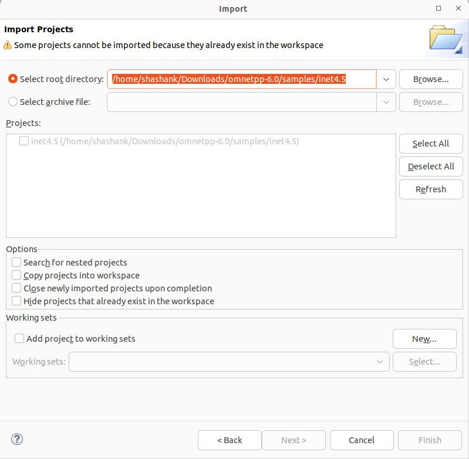

# 24AL733 - Connected Vehicles and Security

  <br/>
 

## CVS#07 - Role of 5G in Vehicle-to-Everything (V2X) Communication

 <br/>
    <br/>
  <br/>

### Problem Statement

The integration of 5G technology into Vehicle-to-Everything (V2X) communication is revolutionizing the landscape of connected and automated mobility. Traditional systems, such as Dedicated Short-Range Communication (DSRC) and LTE-based networks, have struggled with limitations in scalability, latency, and security, which hinder their ability to meet the growing demands of modern V2X applications. As vehicular networks become more data-intensive and time-sensitive, these systems fail to provide the required efficiency, particularly in high-density urban environments where communication channels are easily congested. 5G addresses these challenges with its advanced capabilities, offering low-latency, high-bandwidth, and highly reliable communication solutions that enable seamless data exchange and support real-time decision-making in critical scenarios.

---

### Literature Survey

1. 5G MEC-Enabled Vehicle Discovery Service for Streaming-Based CAM Applications
    * Authors: Gorka Velez, Josu Perez, Angel Martin
    * Source: Multimedia Tools and Applications, 2022
    * Focus: This study highlights the use of Multi-access Edge Computing (MEC)  to optimize vehicle discovery in connected and automated mobility (CAM) applications. The proposed Vehicle Discovery Service (VDS) employs a centralized MEC system to efficiently identify and connect vehicles within a geographical Region of Interest (ROI). This avoids the inefficiencies of traditional broadcast-based discovery methods, particularly in dense urban environments.
    * Contributions:
      * Developed a novel architecture using WebRTC for low-latency streaming.
      * Evaluated spatial accuracy and end-to-end latency for applications like See-Through video streaming.
      * Demonstrated scalability and reduced communication delays using real-world vehicular datasets.
  
2. A Group-Based Multicast Service Authentication and Data Transmission Scheme for 5G-V2X
   * Authors: Ruhui Ma, Jin Cao, Yinghui Zhang, et al.
   * Source: IEEE Transactions on Intelligent Transportation Systems, 2022
   * Focus: This paper introduces a secure and efficient group-based authentication scheme tailored for 5G-V2X multicast services. The model ensures seamless and secure data transmission for a large number of vehicles while addressing issues such as signaling congestion and mobility challenges.
   * Contributions:
     * Introduced a group authentication process to reduce signaling overhead during multicast service access.
     * Proposed dual-key technology for secure and efficient key distribution.
     * Formal verification showed robustness against protocol attacks, ensuring data privacy, anonymity, and unlinkability.
     * Demonstrated superior computational and communication efficiency compared to existing methods.

3. On 5G-V2X Use Cases and Enabling Technologies: A Comprehensive Survey
   * Authors: Ahmad Alalewi, Iyad Dayoub, Soumaya Cherkaoui
   * Source: IEEE Access, 2021
   * Focus: This survey comprehensively reviews V2X use cases, 5G enabling technologies, and their applications in vehicular communication. It maps the requirements of V2X applications to 5G capabilities, such as ultra-reliable low-latency communication (URLLC) and massive machine-type communication (mMTC).
   * Contributions:
     * Provided a detailed classification of V2X use cases into safety, traffic efficiency, and infotainment.
     * Discussed enabling technologies like edge computing, network slicing, full-duplex communication, and artificial intelligence.
     * Highlighted challenges such as resource management, interoperability, and integration of advanced communication protocols.
     * Identified research gaps, including low-latency communication for safety-critical scenarios and efficient spectrum utilization.
4. Toward 5G Edge Computing for Enabling Autonomous Aerial Vehicles
   * Authors: Gerasimos Damigos, Tore Lindgren, George Nikolakopoulos
   * Source: IEEE Access, 2023
   * Focus: This paper explores the use of 5G-enabled edge computing to support time-critical control operations in unmanned aerial vehicles (UAVs). The study emphasizes the role of edge servers in reducing latency for closed-loop control systems, using real-world 5G networks.
   * Contributions:
     * Proposed a 5G-enabled architecture for offloading computationally intensive tasks to edge servers.
     * Evaluated round-trip latency, jitter, and system behavior in high-load scenarios.
     * Experimentally validated the impact of 5G edge computing on UAV performance, including trajectory tracking and obstacle navigation.
     * Identified unexplored areas for optimization, such as path planning and network resource allocation.

---

### Proposed Work

Based on the insights from the literature, the proposed work aims to design and implement a comprehensive 5G-enabled framework for V2X communication. This framework will address the challenges of low-latency data processing, secure communication, and efficient resource utilization in dense and dynamic vehicular environments. The proposed work also integrates real-world testing and simulation to validate the system's performance and reliability.

#### Objective

Validate the effectiveness of V2X communication (V2V, V2I, V2P) in safety-critical scenarios (pedestrian detection, accident alerts, cyberattacks) using a 5G-enabled simulation of the Amrita Vishwa Vidyapeetham, Coimbatore.

#### Key Components

1. 5G Network:

   * Simulate gNBs (5G base stations) and UEs (User Equipment) for vehicles/pedestrians.

   * Configure URLLC (Ultra-Reliable Low-Latency Communication) for accident alerts and eMBB (Enhanced Mobile Broadband) for data-heavy tasks.

2. V2X Communication:

   * CAM/DENM Messages: For real-time coordination (e.g., pedestrian movement, collision warnings).

   * PC5/Uu Interfaces: Direct V2V (PC5) and V2I (Uu) communication.

3. Safety Scenarios:

   * Pedestrian Detection: Trigger alerts when pedestrians cross roads.

   * Accident Scenario: Disseminate emergency alerts to nearby vehicles and emergency services.

   * Cyber Attack: Simulate jamming or spoofing attacks to test network resilience.

---

### Implementation Details

The development and optimization of 5G-V2X systems rely heavily on advanced simulation and testing tools. Traffic simulation platforms like SUMO (Simulation of Urban Mobility) integrate vehicular movement dynamics with communication models, enabling researchers to evaluate network performance under realistic scenarios. Network simulators such as OMNeT++ analyze latency, throughput, and signal interference, providing insights into the impact of traffic loads and mobility patterns on communication efficiency.

### Tools  Used

We have created and tested the overall system in Ubuntu 22.04 SUMO 
and OMNET++ 6.0.0, then we have simulated this for the Amrita Vishwa Vidyapeetham Road using the Open Street MAP(OSM). 
For this, we have created and simulated some models which are part of our overall system in 
SUMO and OMNET++.

#### VEINS: 
This framework is the combination of SUMO and OMNeT++. 

#### SUMO: 

SUMO stands for Simulation of Urban Mobility, is an open source, microscopic, multi-modal 
traffic simulator. The advantage of microscopic simulator is that each individual vehicle can 
be differently controlled. So, it allows for creating special vehicles. It also allows us 
to simulate given traffic demand. The simulation gives flexibility to address a large set of traffic 
management topics. 

In SUMO, road network can be created in three possible ways: 
* Manually, by creating nodes, edges, routes, connection files, using NetEdit tool. 
* Writing the codes directly to .xml files. 
* Exporting the Road network from external sources. 
Network file, route file and configuration file are the minimum required files for running any 
simulation in SUMO 

Network file, route file and configuration file are the minimum required files for running any 
simulation in SUMO  

<p align="center">
  
</p>

#### Installing /Building the SUMO software: 
**For Ubuntu:**
1. First install the required Library required for SUMO installation: 
   sudo apt-get install git cmake python3 g++ libxerces-c-dev libfox-1.6-dev libgdal-dev libproj-dev libgl2ps-dev 

   some optional libraries: sudo apt-get install libavformat-dev libswscale-dev libopenscenegraph-dev swig libgtest-dev libeigen3-dev python3-pip python3-setuptools default-jdk 

   sudo pip3 install texttest 
2. If Installing from Github source  directly then in terminal window 
   git clone --recursive https://github.com/eclipse/sumo

   export SUMO_HOME="$PWD/sumo" 
3. If the source code is already downloaded, then set that as your path.  
4. Now create a build folder for cmake in the sumo root folder 

   mkdir build/cmake-build 

   cd build/cmake-build 

5. To build SUMO run 

   cmake ../..           
6. When it finished run 

   make -j $(nproc) 

   nproc is the number of logical cores in the computer, we can directly put the value, as my computer contains  4 cores the command is: 

   make -j4 

   It will take some time to build, after building you can get the SUMO-gui and SUMO file inside the bin folder of SUMO root directory. 
7. If you want to install locally, so that you can directly launch it, type 

   sudo make install 
8. You will get the sumo-gui location into /usr/local/bin/sumo-gui. 

   More description can be found at https://sumo.dlr.de/docs/Installing/Linux_Build.html 
9. If you just want to use SUMO, with predefined setting then after installing libraries run this in the terminal 

```sudo add-apt-repository ppa:sumo/stable ```

```sudo apt-get update ```

```sudo apt-get install sumo sumo-tools sumo-doc```

####  Imported MAP of Amrita Vishwa Vidyapeetham

MAP is imported using OSM web wizard. The 
area can be selected by clicking the checkbox Select Area. 

<p align="center">
  
</p>
 
Through Traffic Factor defines how many times it is more likely for an edge at the boundary of the simulation area being chosen compared to an edge entirely located inside the simulation area. Large value for Through Traffic Factor defines many vehicles depart and arrive at the boundary 
of the simulation area. Count parameter implies that how many vehicles are generated per hour and lane-kilometer.

<p align="center">
  
</p>

<p align="center">
  
</p>

#### Amrita Vishwa Vidyapeetham, Coimbatore area from OSM

<p align="center">
  
</p>

#### OMNeT++ 

   OMNeT++ stands for Objective Modular Network Testbed in C++ is an extensible, modular, component-based C++ simulation library and framework, for building network simulators. It is free for non-commercial simulations like at academic institutions and for teaching. In this several module (component) can be grouped together to form a compound module. 

#### Installing OMNET++ 

**For Ubuntu:** 
1. Before installing the OMNET++ install the required libraries by typing 

   ```
   $ sudo apt-get update libosgearth-dev gnome-color-chooser nemiver 

   $ sudo apt-get install build-essential gcc g++ bison flex perl \python python3 qt5-default libqt5opengl5-dev tcl-dev tk-dev \libxml2-dev zlib1g-dev default-jre doxygen graphviz libwebkitgtk-3.0-0 openscenegraph-plugin-osgearth openmpi-bin libopenmpi-dev libpcap-dev
   ```
   
2. Download the source file from https://omnetpp.org/download/, file named as omnetpp
6.0.0-src-linux.tgz. 
3. Copy the file to your preferred installation directory. 
4. Go the copied archive location >open terminal > extract file by typing
   ```
   $ tar xvfz omnetpp-6.0.0-src-linux.tgz 

   $ cd omnetpp-6.0.0 

   $ . setenv  
   ```
   (note  : space between . and .setenv) 
6. For setting environment variable permanently open .bashrc  in your home directory
   ```
   gedit ~/.bashrc 
   ```
7. Add the  bin path in the end of file and save it, for my system the command is like this 
  ```
   export PATH=$PATH:/home/amit/Documents/Project/omnetpp
  ```
5.6.2-src-linux/omnetpp-6.0.0/bin 
8. Now close the terminal and open again. 
9. Go to extracted Omnet++ directory and type 
   ```
   $ ./configure
   ```
<p align="center">
  
</p>

   ```
   $ make 
   ```

<p align="center">
  
</p>

   ```
   $ omnetpp 
   ```  
9. Test the installation and set the workspace. 
10. Setting the workspace window will look like below, click launch.

<p align="center">
  
</p>

#### Creating and running simulation in OMNET++ 
   For beginners, it is recommended to go to the samples folder in OMNET++ and select the Tic Toc example to have better working understanding. 

A project can be imported by following below steps: 

1. Go to File->Import->General->Existing Project into workspace and click next.

<p align="center">
  
</p>
2. Select the root directory of the project, select the projects (check box), after that click finish. 
<p align="center">
  
</p>
3. You would be able to see the imported project in Project explorer (left  side). 
<p align="center">
  
</p>

#### OMNET++ Modules 

Some of them are as below: 

* .ned files: describe the module structure with parameters, gates, etc. 
* .msg files: define message types and add data fields to them. 
* Simple module sources: they are C++ files, with .h/.cc suffix. 
* omnetpp.ini file: configuration file 
 
Parameters can be assigned in .ned files or in the configuration file .When the program is started, 
it first reads the NED files, then the omnetpp.ini is called. The configuration file contains settings 
that control the simulation execution, values for model parameters, etc. My Version is 6.0.0. 

#### VEINS   
 
It is an open-source framework for running Vehicular Network Simulations. It helps to make the 
communication between SUMO and Omnet++. 
Building Project using VEINS: 
1. After successful installation of SUMO and OMNET++, download Veins from 
https://veins.car2x.org/download/. My version is 5.3. 
2. Unpack it and import into the OMNET++ IDE workspace. 
3. Build the imported project (ctrl+B).

#### SIMU5G   
 
Building Project using SIMU5G: 
1. After successful installation of OMNET++, download Simu5G from 
https://github.com/Unipisa/Simu5G. 
2. Import into the OMNET++ IDE workspace. 
3. Build the imported project (ctrl+B).

(note: also we can install inside the OMNET++ in Help -> Install simulation model -> select the version and click install)

#### INET   
 
Building Project using INET: 
1. After successful installation of OMNET++, download INET from 
https://github.com/inet-framework/inet/releases/tag/v4.5.0. My version is 4.5. 
2. Import into the OMNET++ IDE workspace. 
3. Build the imported project (ctrl+B).

(note: also we can install inside the OMNET++ in Help -> Install simulation model -> select the version and click install)

#### Communication between OMNET++ and SUMO 
Below command allows OMNET++ to interact with SUMO over port 9999: 

veins_launchd-path -vv -c sumo-gui path 

For my system command is like this 

'/home/shashank/Downloads/omnetpp-6.0/samples/veins-veins-5.3/sumo-launchd.py' -c '/usr/bin/sumo'

If you want to use SUMO-GUI replace SUMO with SUMO-GUI as below: 

'/home/shashank/Downloads/omnetpp-6.0/samples/veins-veins-5.3/sumo-launchd.py' -c '/usr/bin/sumo-gui'

|Category |Tools |Purpose |
| ------- |------|--------|
|  Map & Traffic    |OpenStreetMap (OSM), SUMO | Create road network, simulate vehicles/pedestrians, and traffic dynamics.|
|Network Simulation |OMNeT++, Simu5G, INET Framework |Model 5G NR, gNBs, UEs, and V2X communication protocols.|
|Integration |Veins, TraCI (SUMO-OMNeT++ API) |Synchronize SUMO traffic with OMNeT++ network simulation.|
|Analysis | SUMO-GUI |Visualize KPIs (latency, packet loss), debug, and analyze network traffic.|

#### Methodology

1. Map Preparation:

   * Extract Amrita Vishwa Vidyapeetham, Coimbatore area from OSM.

   * Convert OSM to SUMO format using netconvert and define traffic demand.

2. Traffic Simulation:

   * Model vehicles, pedestrians, and traffic lights in SUMO.

   * Define routes for peak-hour traffic (e.g., college entry/exit times).

3. 5G Network Setup:

   * Deploy gNBs in OMNeT++/Simu5G to cover the campus area.

   * Assign UEs to vehicles/pedestrians with QoS profiles (e.g., URLLC for DENM messages).

4. Scenario Implementation:

   * Pedestrian Detection: Use CAM messages to broadcast pedestrian locations.

   * Accident Alert: Generate DENM messages on collision detection.

   * Cyber Attack: Inject malicious nodes to disrupt communication.

5. Validation:

   * Compare KPIs (latency, packet delivery ratio) across scenarios.

   * Test network resilience during attacks (e.g., fake message detection).

---
### Methodology 
#### Architecture

#### Layers

1. Traffic Simulation Layer (SUMO):

   * Vehicles, pedestrians, and traffic lights.

   * Real-time mobility data exported via TraCI API.

2. Network Simulation Layer (OMNeT++/Simu5G):

   * 5G NR Stack: gNBs, AMF, UPF (Simu5G modules).

   * V2X Protocols: CAM/DENM message handlers.

   * UEs: Vehicles and pedestrians with 5G connectivity.

3. Application Layer:

   * Pedestrian detection logic.

   * Accident alert system.

   * Cybersecurity modules (e.g., intrusion detection).

4. Attack/Scenario Layer:

   * Malicious nodes for jamming/spoofing.

   * Emergency event triggers (e.g., sudden braking in SUMO).

#### Data Flow

* SUMO sends vehicle/pedestrian positions to OMNeT++ via TraCI.

* OMNeT++ processes V2X messages (CAM/DENM) over the 5G network (Simu5G).

* Application layer logic triggers alerts based on received data.

* Attack scenarios disrupt communication (e.g., fake DENM messages).
<p align="center">
  
</p>

<p align="center">
  
</p>
<p align="center">
  
</p>

#### Accident Alert

By importing an OSM map into OMNeT++ and adding project properties to reference the INET, Veins, and Simu5G libraries (which handle communication protocols), the simulation environment is properly prepared. The module structure is set up in the .ned file with the appropriate parameters, and the omnetpp.ini file is configured to enable the Accident Alert scenario. When an accident occurs, the affected vehicle immediately communicates the incident information to nearby vehicles, and this alert is observable during simulation. 

Note that it’s essential to enable communication between SUMO and OMNeT++ before running the simulation. 

Once the simulation starts and an accident happens, the information is broadcast to other vehicles as shown in the figures below:
<p align="center">
  
</p>
<p align="center">
  
</p>
<p align="center">
  
</p>

#### Obestacal /Pedestrian Alert 

Similarly, by importing the OSM map into OMNeT++ and configuring the project to reference the INET, Veins, and Simu5G libraries, the .ned file module structure is defined with the necessary parameters. The omnetpp.ini file is set up for the Obstacle (or Pedestrian) Alert scenario. When an obstacle or pedestrian event occurs, the affected vehicle sends alert messages to other vehicles. Just like with the Accident Alert, 

ensuring proper communication between SUMO and OMNeT++ before the simulation starts is crucial. Once active, any obstacle event triggers alerts that are transmitted and visible during the simulation, as depicted in the figures below:
<p align="center">
  
</p>
<p align="center">
  
</p>
<p align="center">
  
</p>
<p align="center">
  
</p>
---

### Conclusion
The 5G-enabled V2X framework offers significant improvements in road safety and communication between vehicles. In this study, a Pedestrian Detection Logic and an Accident Alert System were implemented, allowing vehicles to exchange important safety information. This helps improve the response time in emergency situations and increases overall traffic safety.

While the framework does not yet include simulations for cybersecurity or malicious attacks, it lays the foundation for further research in these areas. The integration of 5G into vehicle communication systems demonstrates the potential to create safer and smarter transportation networks.

#### Future Scope
Future improvements can focus on the following areas:

* Cybersecurity Integration: Although not simulated yet, adding cybersecurity measures will be crucial to protect against malicious activities, ensuring the safety of vehicle communications.
* Real-World Testing: Testing the system with actual 5G networks and vehicles will help better understand its performance in real-world traffic conditions.
* Edge Computing: Using edge computing can help reduce delays and make the system more responsive in critical situations.
---

### Mapping to Sustainable Development Goals (SDG)

The 5G-enabled V2X framework aligns with several Sustainable Development Goals (SDGs) by addressing key challenges:

| Sustainable Development Goal (SDG) | Contribution |
|------------------------------------|--------------|
| SDG 3: Good Health and Well-being              | Enhancing road safety reduces accidents and fatalities, contributing to healthier communities. |
| SDG 11: Sustainable Cities and Communities     | Promoting urban sustainability through smarter transportation systems. |
| SDG 13: Climate Action                         | Reducing emissions and fostering eco-friendly practices in transportation. |
| SDG 9: Industry, Innovation, and Infrastructure | Leveraging advanced communication technologies for innovation. |
| SDG 17: Partnerships for the Goals              | Encouraging global collaboration and knowledge exchange. |

---

### References
[1]	W. Mao, O. U. Akgul, B. Cho, Y. Xiao, and A. Yla-Jaaski, “On-Demand Vehicular Fog Computing for Beyond 5G Networks,” IEEE Trans Veh Technol, vol. 72, no. 12, pp. 15237–15253, Dec. 2023, doi: 10.1109/TVT.2023.3289862.

[2]	A. Y. Alhilal, B. Finley, T. Braud, D. Su, and P. Hui, “Street Smart in 5G: Vehicular Applications, Communication, and Computing,” IEEE Access, vol. 10, pp. 105631–105656, 2022, doi: 10.1109/ACCESS.2022.3210985.

[3]	A. Alalewi, I. Dayoub, and S. Cherkaoui, “On 5G-V2X Use Cases and Enabling Technologies: A Comprehensive Survey,” 2021, Institute of Electrical and Electronics Engineers Inc. doi: 10.1109/ACCESS.2021.3100472.

[4]	S. Hakak et al., “Autonomous vehicles in 5G and beyond: A survey,” Feb. 01, 2023, Elsevier Inc. doi: 10.1016/j.vehcom.2022.100551.

[5]	M. S. Salek et al., “A Review on Cybersecurity of Cloud Computing for Supporting Connected Vehicle Applications,” Jun. 01, 2022, Institute of Electrical and Electronics Engineers Inc. doi: 10.1109/JIOT.2022.3152477.

[6]	K. Ramezanpour and J. Jagannath, “Intelligent zero trust architecture for 5G/6G networks: Principles, challenges, and the role of machine learning in the context of O-RAN,” Nov. 09, 2022, Elsevier B.V. doi: 10.1016/j.comnet.2022.109358.

[7]	R. Ma, J. Cao, Y. Zhang, C. Shang, L. Xiong, and H. Li, “A Group-Based Multicast Service Authentication and Data Transmission Scheme for 5G-V2X,” IEEE Transactions on Intelligent Transportation Systems, vol. 23, no. 12, pp. 23976–23992, Dec. 2022, doi: 10.1109/TITS.2022.3197767.

[8]	G. Damigos, T. Lindgren, and G. Nikolakopoulos, “Toward 5G Edge Computing for Enabling Autonomous Aerial Vehicles,” IEEE Access, vol. 11, pp. 3926–3941, 2023, doi: 10.1109/ACCESS.2023.3235067.

[9]	S. Lu and W. Shi, “Vehicle as a Mobile Computing Platform: Opportunities and Challenges,” IEEE Netw, 2023, doi: 10.1109/MNET.2023.3319454.

[10]	G. Velez, J. Perez, and A. Martin, “5G MEC-enabled vehicle discovery service for streaming-based CAM applications,” Multimed Tools Appl, vol. 81, no. 9, pp. 12349–12370, Apr. 2022, doi: 10.1007/s11042-021-11421-x.

[11]	S. Chen et al., “Wireless Networks Cellular Vehicle-to-Everything (C-V2X).”


---
