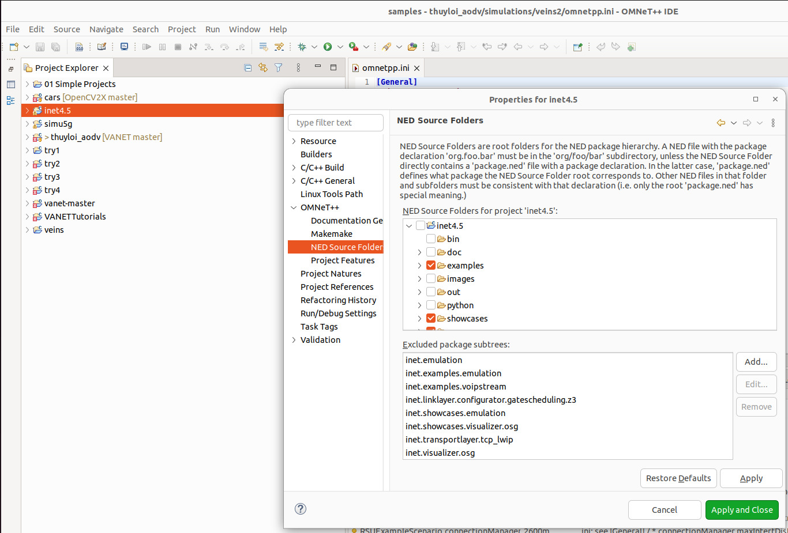
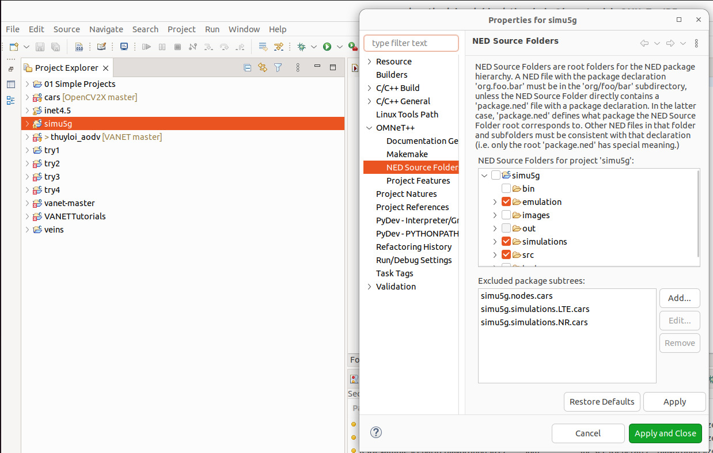
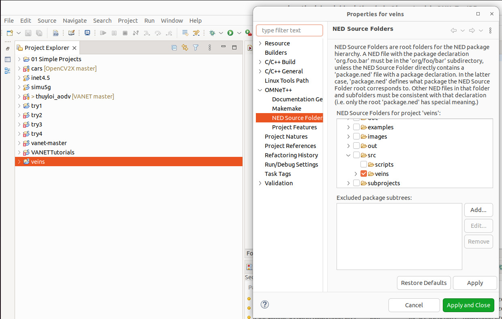

## Challenges

### Tools Support 

| Sl. No | Ubuntu Version | SUMO Version | OMNeT++ Version | Veins Version | Remarks |
|:------:|:--------------:|:------------:|:--------------:|:-------------:|:-------:|
| 1 | 22.04 | 1.20.0 | 6.0.0 | 5.3 | Working fine |
| 2 | 22.04 | 1.20.0 | 6.1.0 | 5.2 | Veins version is not compatible |
| 3 | 22.04 | 1.20.0 | 5.6.0 | 5.0 | Not supported on Ubuntu 22.04 |

> **Note**: In Windows, some dependencies and software could not be installed properly.

---

### NED Packages Excluded

In **INET** and **Simu5G**, some packages were excluded because certain functionalities were not working.  
The excluded packages are shown below:

  

  

---

### Missing Subfolder in Veins

In **Veins**, the `veins_inet` subfolder was not considered during the build process.  
Because of this, some packages were excluded, as shown below:

  

