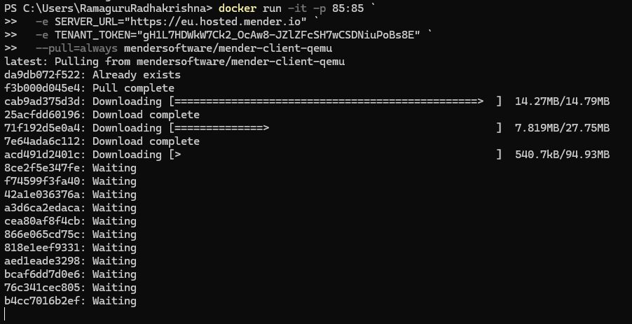
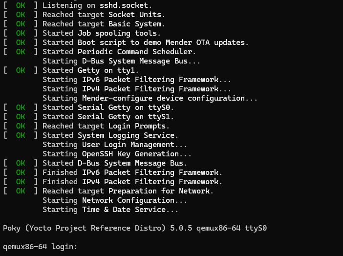
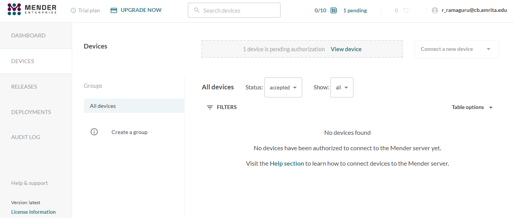
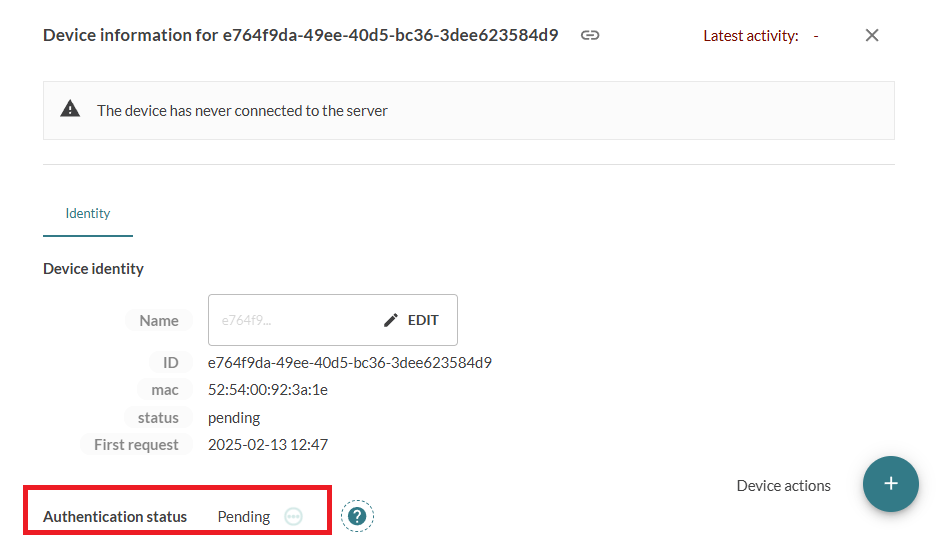
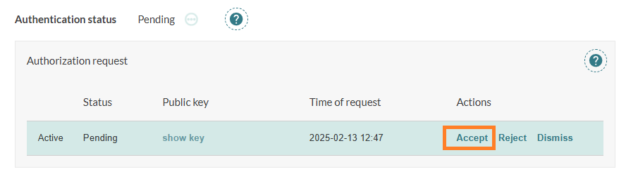
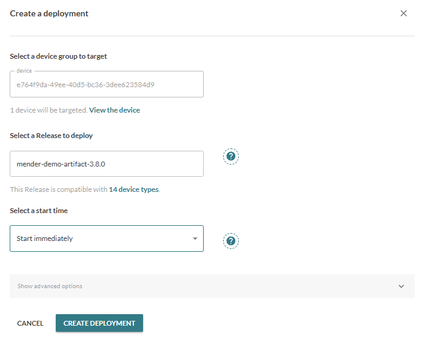
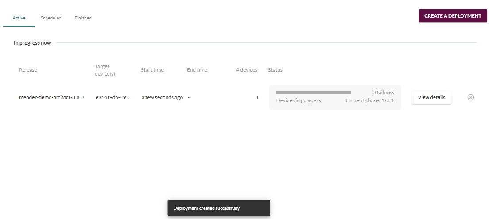
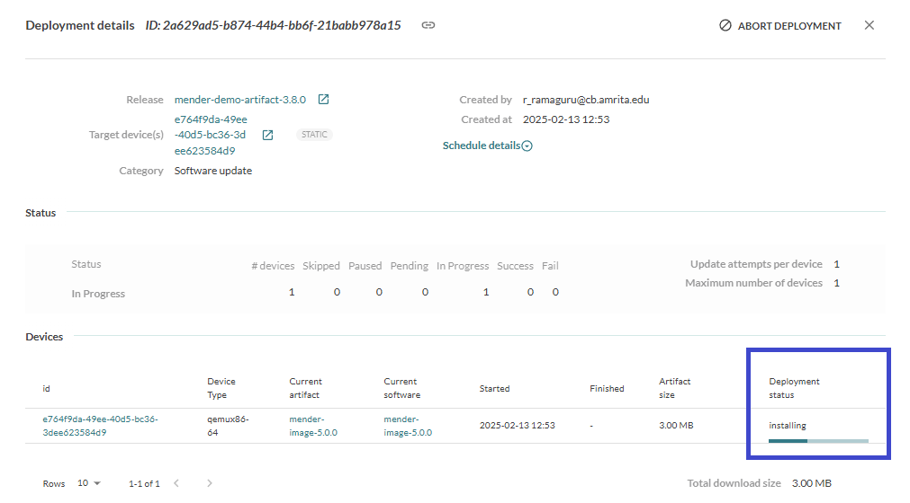
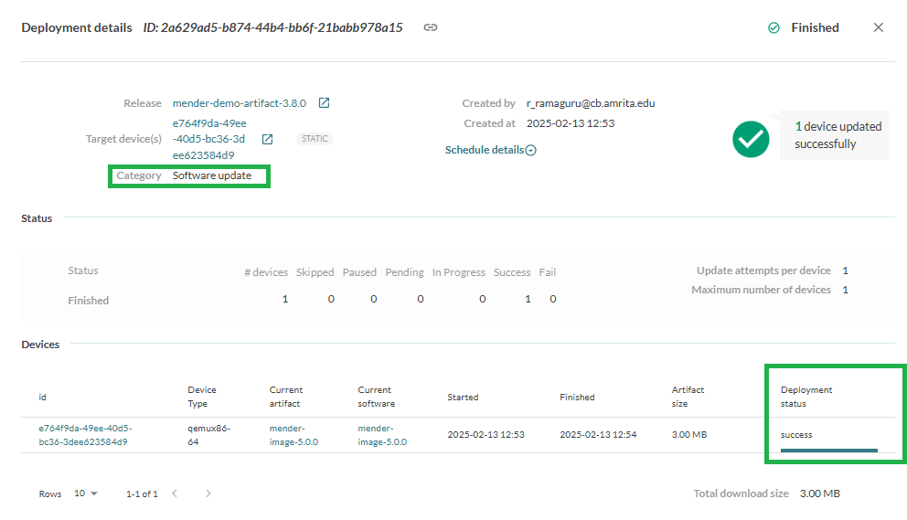

# 24AL733 - Connected Vehicles and Security 
  <br/>

## Resources for OTA - Mender
Mender is a 
- professional, purpose-built OTA update solution
- designed by cyber security experts
- complete over-the-air (OTA) update infrastructure for developers and support teams

### Getting Started
- [Signup](https://hosted.mender.io/ui/signup) Here
- Connect up to 10 devices free for 12 months

### Device Configuration (Docker Device)

- Run the below command in Windows Powershell. 
```
docker run -it -p 85:85 `
  -e SERVER_URL="https://eu.hosted.mender.io" `
  -e TENANT_TOKEN="gH1L7HDWkW7Ck2_OcAw8-JZlZFcSH7wCSDNiuPoBs8E" `
  --pull=always mendersoftware/mender-client-qemu
```
<h5 align="center">Docker Device Downloading</h5>
<p align="center">
	
</p>

<h5 align="center">Docker Device Ready</h5>
<p align="center">
	
</p>

### Device Authorization 
<h5 align="center">Mender Device Pending Authorization</h5>
<p align="center">
	
</p>

<h5 align="center">Mender Device Pending Authorization (Detailed)</h5>
<p align="center">
	
</p>

<h5 align="center">Mender Device Authorization Accept</h5>
<p align="center">
	
</p>

### Deployment
<h5 align="center">Deployment Creation</h5>
<p align="center">
	
</p>

<h5 align="center">Deployment Created</h5>
<p align="center">
	
</p>

<h5 align="center">Deployment Progress</h5>
<p align="center">
	
</p>

<h5 align="center">Deployment Success</h5>
<p align="center">
	
</p>
